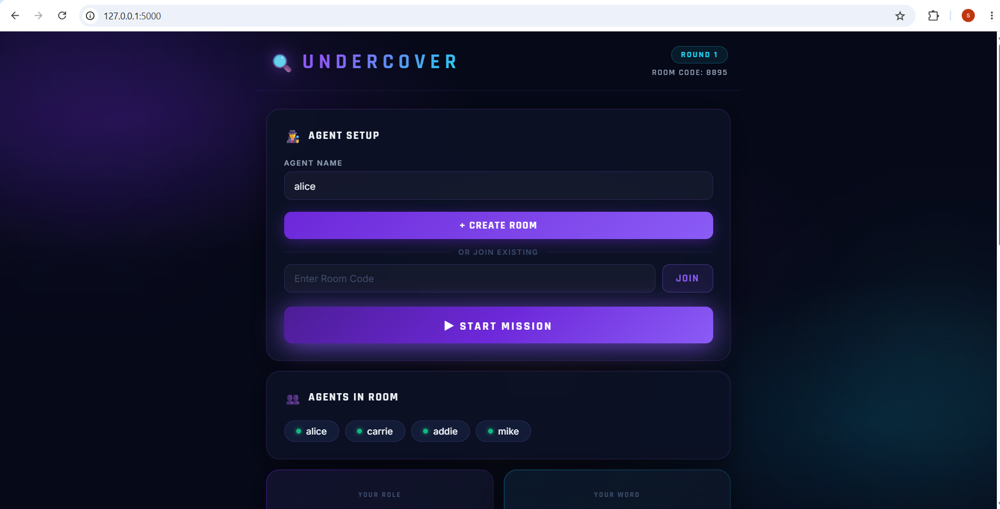
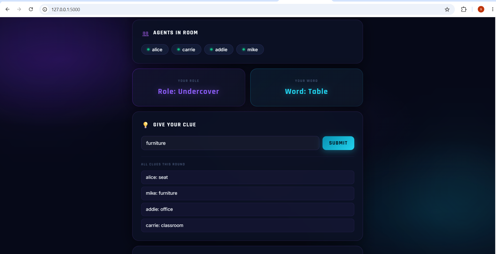
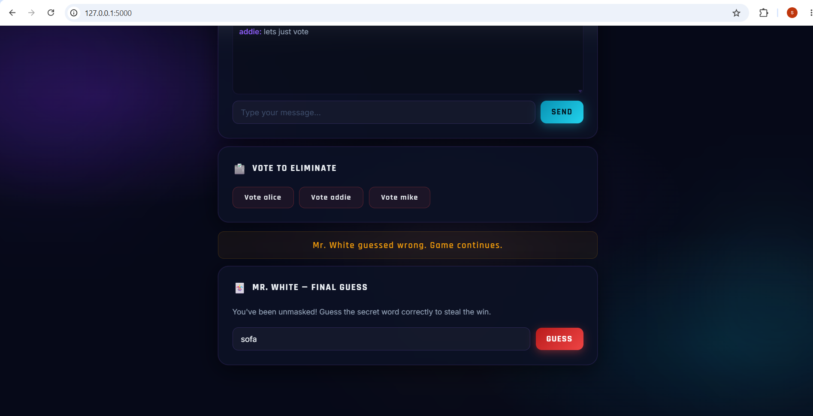
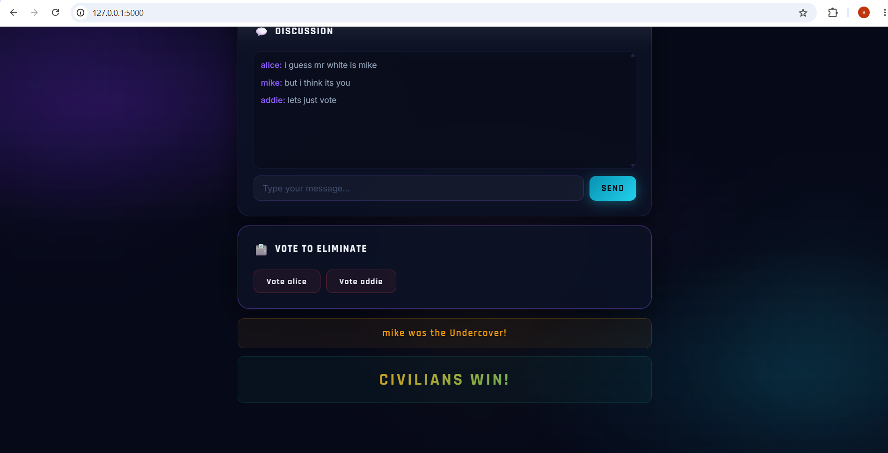

# AI Undercover Multiplayer Game

A real-time multiplayer social deduction game inspired by **Undercover** and **Mr. White**, enhanced with AI-generated word pairs using Llama 3.2.

## About the Project

AI Undercover Multiplayer Game is a browser-based multiplayer game where players are secretly assigned different roles and must use deduction, communication, and strategy to identify hidden opponents.

Each round, players provide clues related to their assigned words and vote to eliminate suspicious participants. The game includes the popular **Mr. White** mechanic, where a player with no assigned word gets a chance to guess the secret word after being eliminated.

The project combines real-time multiplayer communication with AI-powered content generation to create a unique gameplay experience.

## Features

### Real-Time Multiplayer Gameplay

* Create and join private game rooms.
* Live synchronization of players, clues, votes, and results.
* Instant updates using WebSockets.

### AI-Generated Word Pairs

* Dynamic word generation using Ollama and Llama 3.2.
* Similar but distinct words for Civilians and Undercover players.
* New gameplay experience every round.

### Multiple Roles

* **Civilian** – Receives the main secret word.
* **Undercover** – Receives a similar but different word.
* **Mr. White** – Receives no word and must deduce it from clues.

### Voting System

* Players vote after each clue round.
* Automatic vote counting.
* Tie vote detection and handling.
* Eliminated players can no longer vote.

### Mr. White Guess Mechanic

* Eliminated Mr. White receives a chance to guess the secret word.
* Correct guess results in an immediate Mr. White victory.
* Incorrect guess allows the game to continue.

### Automatic Round Progression

* New clue rounds start automatically.
* Dynamic player turn ordering.
* Real-time round updates.

### Win Conditions

* Civilians win by eliminating both Undercover and Mr. White.
* Undercover wins by surviving until the end.
* Mr. White wins by correctly guessing the secret word.

## Technology Stack

### Backend

* Python
* Flask
* Flask-SocketIO

### Frontend

* HTML5
* CSS3
* JavaScript

### AI Integration

* Ollama
* Llama 3.2

### Real-Time Communication

* Socket.IO
* WebSockets

## Project Structure

```text
UNDERCOVER_GAME/
│
├── app.py
├── requirements.txt
│
└── templates/
    └── index.html
```

## Installation

### Clone the Repository

```bash
git clone https://github.com/sarvaniperecharla-coder/AI-Undercover-Multiplayer-Game.git
cd AI-Undercover-Multiplayer-Game
```

### Install Dependencies

```bash
pip install -r requirements.txt
```

### Start Ollama

Ensure Ollama is installed and running.

```bash
ollama run llama3.2
```

### Run the Application

```bash
python app.py
```

Open your browser and navigate to:

```text
http://127.0.0.1:5000
```

## Key Skills Demonstrated

* Full-Stack Web Development
* Real-Time Application Development
* WebSocket Programming
* Multiplayer Game Logic
* AI Integration with Large Language Models
* Event-Driven Architecture
* Python Backend Development
* Frontend Development
* State Management

## Future Improvements

* User authentication
* Leaderboards and statistics
* Responsive mobile design
* Public matchmaking system
* Player avatars and profiles
* Database integration
* Cloud deployment
* Voice chat support
* AI-generated clue suggestions

## Author

**Sarvani Perecharla**

Engineering Student | AI Enthusiast | Backend Developer

GitHub: https://github.com/sarvaniperecharla-coder
## Screenshots

### Lobby Screen



### Role Screen
winner.png


### Vote Screen



### Winner Screen




